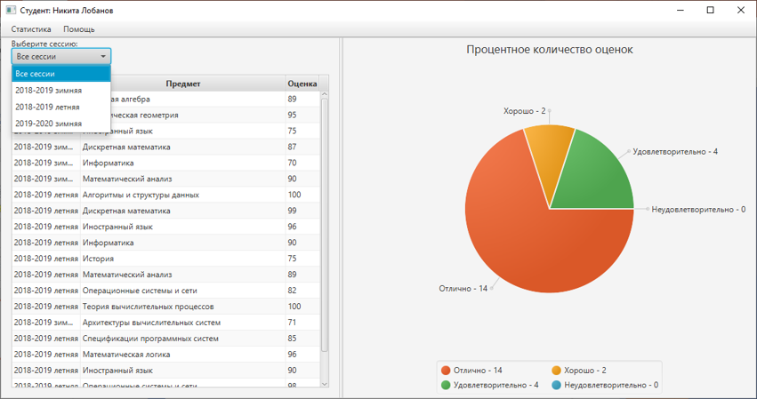
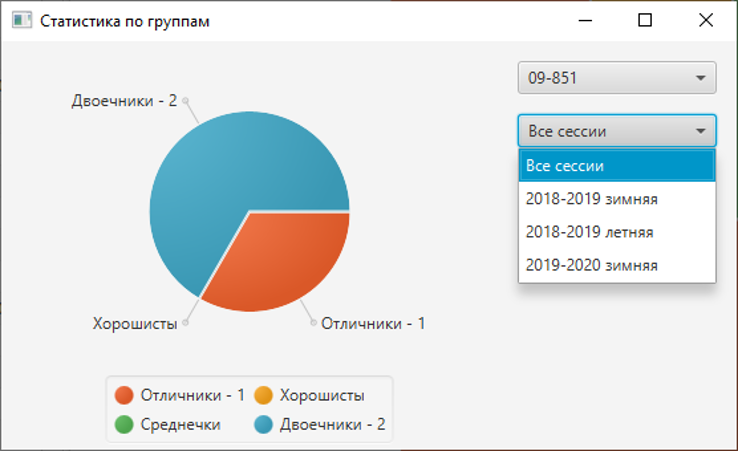
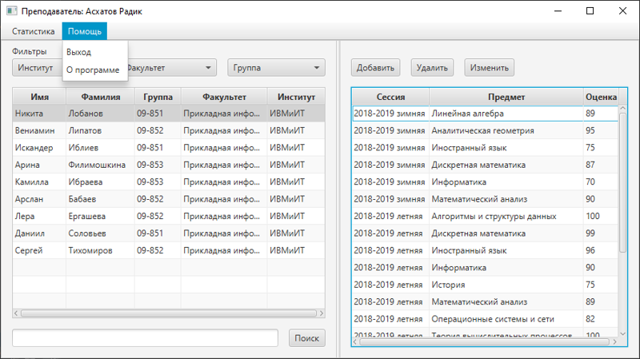
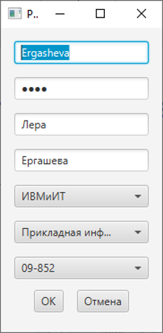

# StudSystem
_3rd term technical practice._
The task was to make a desktop application for accounting the marks of students. The main requirements was:
* application should have GUI (made with JavaFX)
* no usage of databases (files only allowed)
* my project requirements:
    * supporting multiple account types, such as students, teachers.
    * log in with passwords
    * teachers can read/write marks, but students can only read
    * informational system should provide some academic performance analysis 
>
>
>Student's window with academic performance stats

>
>
>Example of window with overall groups stats

>
>
>Teacher's main window

>
>
>Student-account adding/editing window
###### Some more description
Here is my [coursework](КР_2019_Саидмуродов_СС.docx) in russian.
This is a [presentation](Успеваемость_студентов_на_факультете.pptx) with a few screenshots of working application.